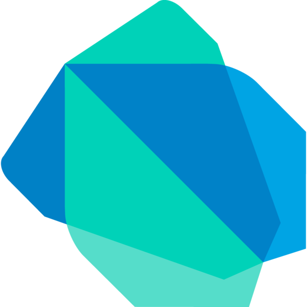
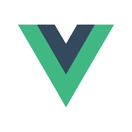
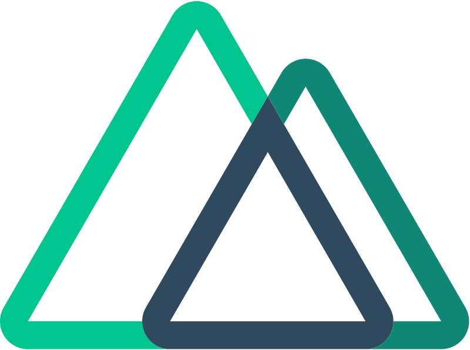

# Hi, I'm Termin! 👋

## 🚀 About Me

---

I'm a Front-End developer & Flutter Developer.

# 🛠 Skills

## Languages I Use

---

 
 

## 📙 Frameworks/Libraries I use

---

 
 

## 🔗 Links

---

 

## 📊 Stats

---

 

